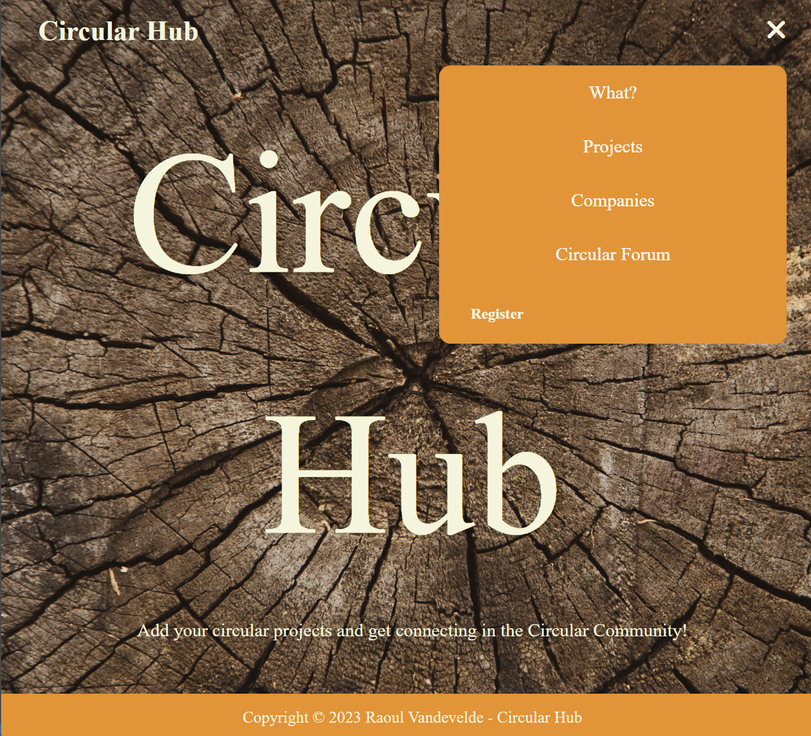

# Welcome to the Circular Hub README

## Table of Contents
* [Introduction](#introduction)
* [Prerequisites](#prerequisites)
* [Installation](#installation)
* [Usage](#usage)
* [Authentication](#authentication)
* [Error handling](#error-handling)
* [Contact](#contact)


## Introduction
- This is a basic build for a Laravel project, with a focus on Circular Economy. Its purpose to inform about and how to work with circular economy projects. 

- build a forum website on which users can add their projects and company to connect with other circular-enthousiasts.

- authentication and authorization for both admin and users

- build with Laravel framework in PHP

- This project is still a Work In Progress 


This webapp will allow guests to browse through projects and companies to consult about what they do for circular economy. It is after registering they can add their company and project to connect with other users. Only admins will have the authorisation to delete projects or update projects (unless ofcourse it is the users own project).


## Prerequisites
- An IDE like VS code to open the files and read the code.
- Terminal to run the scripts
- A databasemanagement system (e.g.: TablePlus)
- For testing: POSTMAN
- Browser to render the website

## Installing

To run Circular Hub on your own device, PHP as well as MySQL is required.

### Setup

Please check on the Laravel documentation on how to [install Laravel](https://laravel.com/docs/5.4/installation#installation).

In the terminal:
- clone the repository with:
`git clone git@github.com:RalloField/circular-hub.git`

- Open the folder with:
`cd circular-hub`

- Install Composer globally:
`composer install`

### Database Manager

In your database manager you will need to set up a database with the corresponding tables (users, projects, companies, comments) that will used in your project.

---

Navigate in your prefered IDE to the root folder of the project and create a new **.env** file. Copy the contents of the **.env.example** in it. Add the following:

```
HOST=**localhost**
PORT= 4000
DB_NAME = webshop
DB_USER = root
DB_HOST = localhost
DB_PASSWORD = (your password)

JWT_ACCESS_TOKEN = (your access token)
```
---

**_Muy Importante!_**

In the project folder, make sure you add a .gitignore file, and add the following files:

- .env
- node_modules

---


When the project opens in VS Code don't forget to run your migrations using:
- `php artisan migrate`

Now you can run the local development server and follow the instructions on the page itself:
- `php artisan serve`


## Usage

Going from the Homepage the guest can navigate to all the pages but not effectively post or create anything for the page.

He will need to register himself for that.


- The user registers through a form.


- The logged in user is then redirected to register the company.

These two steps must be completed before the logged in user can add a project.


- The user can now add a project to the table overview of projects.


- The user is (together with the admin of the page) authenticated to delete their own projects if they want.
Other users are not.




## Authentication

After being logged in, users can add projects of their company and interact on the forum with other users.
They are only authorized to edit/delete their own projects of their company.

Guests are only allowed to 'view' the pages. No interaction is allowed.

Admins are allowed to delete or edit the pages if they desire to do so.


## Error handling

The error handling in the forms are handled in Laravel with Request files in which the limitations or requirements are set for each field.

## Contact
Created by [Raoul Vandevelde](https://github.com/RalloField) - feel free to contact me!


